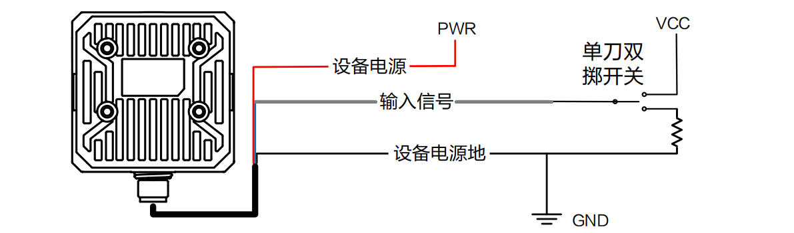

# ID3000

### 触发原理：信号端接收到信号

1. Level High：高电平触发
2. Level Low：低电平触发
3. Rising Edge：上升沿触发
4. Falling Edge：下降沿触发

.png>)

举例：

IDMVS设置高电平触发，选择line0 作为信号输入端

.png>)

硬件接线，信号线line0（灰色），公共端就是设备电源地（黑色）

触发原理：外部信号接到line0， 外部信号的公共端接到读码器的电源地，当外部信号是高电平时即可触发读码器。

### 外部电平直接触发

### PNP型输入接线图（推荐使用330欧下拉电阻）

.png>)

### NPN型输入接线图（推荐使用1k欧上拉电阻）

.png>)

