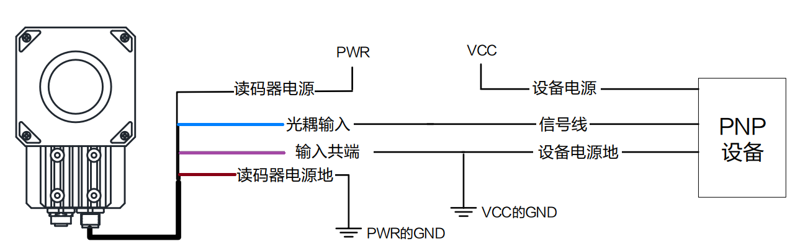

# ID5000

### 触发原理：信号端接收到信号

1. Level High：高电平触发
2. Level Low：低电平触发
3. Rising Edge：上升沿触发
4. Falling Edge：下降沿触发

.png>)

举例：

IDMVS设置高电平触发，选择line0 作为信号输入端

.png>)

硬件接线，信号线line0（蓝色），公共端就是输入信号地（紫色）

触发原理：外部信号接到line0（蓝色）， 外部信号的公共端接到输入信号地（紫色），当外部信号是高电平时即可触发读码器。

### PNP型输入接线图

### NPN型输入接线图

.png>)

