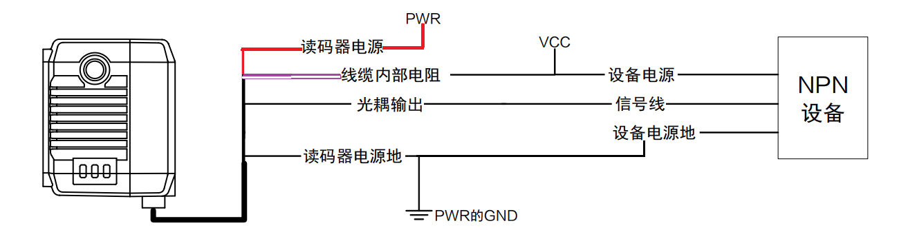

# ID2000

ID2000 输出电流较小，最大只能输出25mA， 建议使用有源的继电器模块，如下图这种。

.png>)

.png>)

.png>)

.png>)

### IDMVS参数设置

.png>)

此处建议使用软触发的模式，便于测试输出信号是否发生变化

.png>)

### 常见问题

Q、输出没有变化

A、确认IDMVS参数是否设置好，如果确认参数没问题，则改用PNP接法

.png>)

